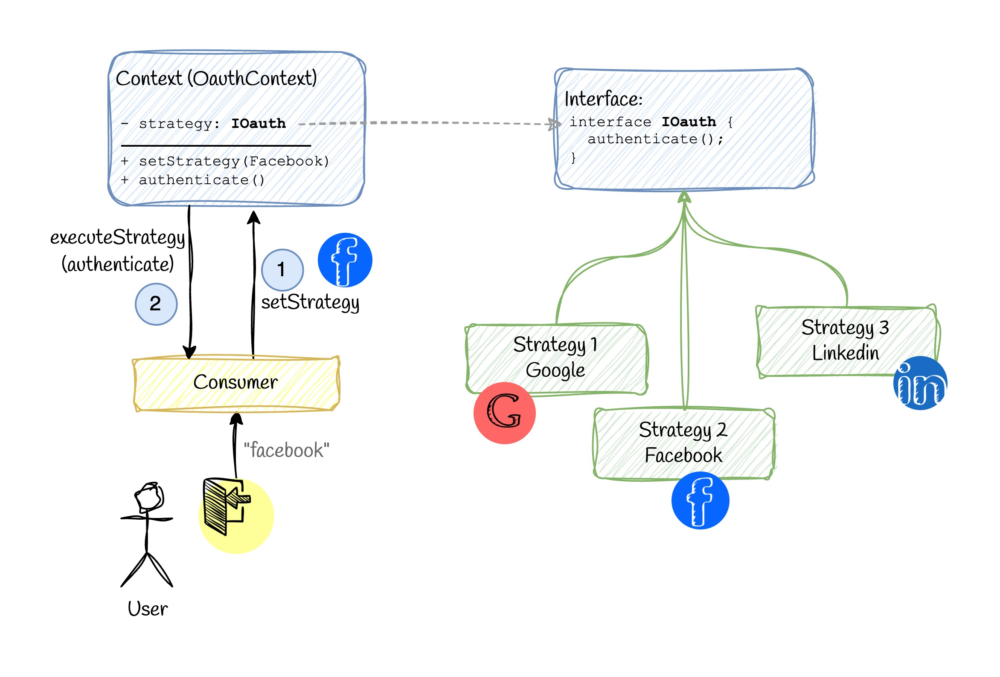

<div align="center">

# Real World Design Patterns

Explore real-world scenarios and best practices for design patterns in this comprehensive repository.

[](https://github.com/vahidvdn/realworld-design-patterns/actions/workflows/ci.yml)
[](https://codecov.io/github/vahidvdn/realworld-design-patterns)


[](https://github.com/vahidvdn/realworld-design-patterns/compare)


</div>

<hr />

Elevate your software design skills with practical examples and insightful discussions. This workspace has been generated by [Nx, Smart Monorepos · Fast CI](https://nx.dev). For each design pattern, there is folder based on `TypeScript`. If you are comming from another programming language world, don't worry. They are not complicated. Also, tests are included for each pattern. Also you can see bad practices to understand use cases.

## How to Learn? 📖

### Prerequisites

First, go over the [prerequisites](./PREREQUISITES.md) of design patterns—after that, it'll be much easier to move forward.

### Patterns

You can open each directory, for instance:

```
$ cd app/strategy-pattern
```

There is a `README` file that you can review first.

## Structure of Readme

Here is some steps in each `README` file:

- 💡 Use Case: a short description about the specific problem that we want to solve.
- ❌ Bad Practice: a typical solution that works but not in a proper way.
- ✅ Good Practice: implementing the specified design pattern to solve the problem in a proper way.

Diagram: There is also a diagram to represent the oveview of the design pattern to understand better. These are **some examples**:

#### Observer Pattern


------
#### Decorator Pattern


------
#### Chain of Responsibility Pattern


------
#### Strategy Pattern


------


Open `/app` folder to see [all design patterns](https://github.com/vahidvdn/realworld-design-patterns/tree/master/app). ✅

## How to Run

In the root directory, run:

```
$ npm install
```

To run the design pattern:

```
$ npm run -w PATTERN_NAME start
```

For instance **PATTERN_NAME** can be strategy-pattern


To run the bad practice:

```
$ npm run -w PATTERN_NAME start:bad
```

## Run Tests

In order to run tests, run the following command. (add `:watch` to run it in watch mode):

```
$ npm run test
```

## Test Coverage

Run the following command to evaluate test coverage:

```
$ npm run test:cov
```

To see the coverage report, just run:

```
$ npm run test:cov:open
```

## Contributing

Contributing to a community project is always welcome.

## Checklist

- [x] Strategy Pattern
- [x] Dependency Injection Pattern
- [x] Chain of Responsibility Pattern
- [x] Builder Pattern
- [x] Decorator Pattern
- [x] Template Method Pattern
- [x] Observer Pattern
- [x] Command Pattern
- [x] Composite Pattern
- [x] Adapter Pattern
- [x] Simple Factory Method
- [x] Factory Method Pattern
- [x] Abstract Factory Pattern
- [x] Proxy Pattern
- [ ] Facade Pattern
- [ ] Memento Pattern
- [ ] Singleton Pattern
- [ ] Bridge Pattern
- [ ] Prototype Pattern
- [ ] State Pattern
- [ ] Mediator Pattern
- [ ] Iterator Pattern
- [ ] Flyweight Pattern
- [ ] Visitor Pattern

## Support

Any support is welcome. You can give the project a star, if you liked it ⭐


## License

MIT
