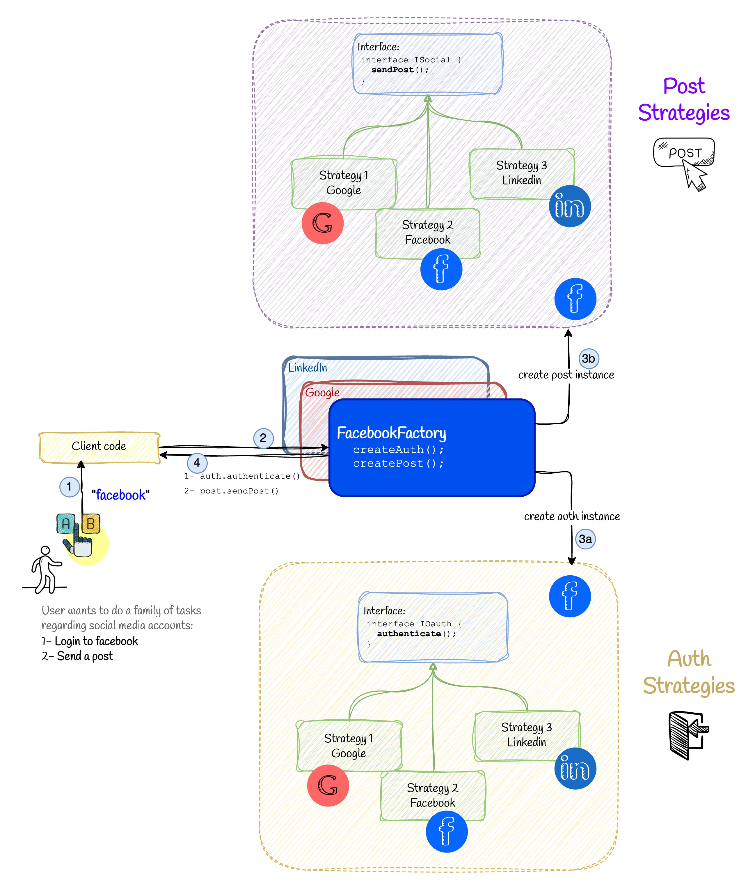

# 📚 Abstract Factory


## 💡 Use Case

We have already learnt that the Factory Method pattern is used to create a **single type** of product. In this use case, we will learn how to create a **set of related products** using the Abstract Factory pattern. Let's first compare the two patterns:

| Concept   | Factory Method                                                  | Abstract Factory                                                                   |
| --------- | --------------------------------------------------------------- | ---------------------------------------------------------------------------------- |
| Focus     | Creating **one type** of product                                | Creating **families of related products**                                          |
| Structure | Subclass defines how to create a single product                 | Subclass defines how to create a **set of related products**                       |
| Use case  | When you need to decide **which single product** to instantiate | When you need to create **consistent groups of products** (e.g., a whole UI theme) |

## ✅ Good Practice

For example, FacebookFactory is in charge of creating all the products related to Facebook, such as AuthStrategy, PostStrategy, and so on.

```ts
export class FacebookFactory implements SocialNetworkFactory {
  createAuthStrategy(): AuthStrategy {
    return new FacebookAuth();
  }

  createPostStrategy(): PostStrategy {
    return new FacebookPost();
  }
}
```

And to use the factory, we can do the following:

```ts
// facebook
const facebookFactory = new FacebookFactory();
const facebookAuth = facebookFactory.createAuthStrategy();
const facebookPost = facebookFactory.createPostStrategy();
```
