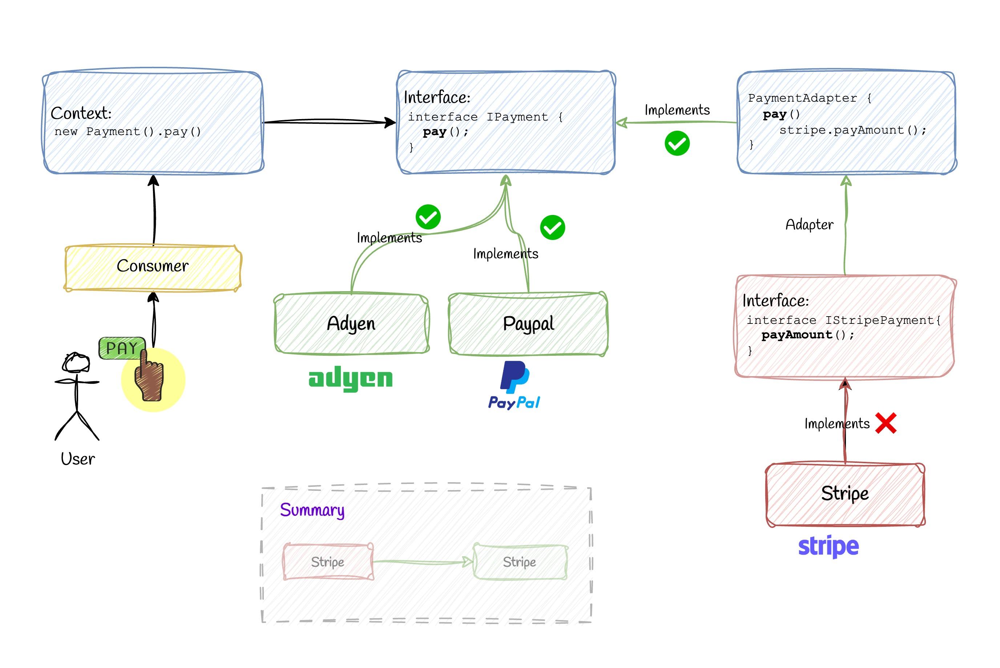

# 📚 Adapter Pattern


## 💡 Use Case

🧠 When to Use Adapter Pattern

- You want to use an existing class, but its interface doesn't match what your code expects.
- You need to reuse legacy code or a third-party library with a different interface.

Here's how you can implement the Adapter Pattern in TypeScript for a payment scenario, where:

- PayPal and Adyen implement the same interface pay().
- Stripe has a different interface payAmount() and needs an adapter.


## ✅ Good Practice

Create a common interface for payment processing and use an adapter to integrate Stripe seamlessly with PayPal and Adyen.

1. Define the Common Interface
   
```ts
// interface.ts
export interface IPaymentGateway {
  pay(amount: number): void;
}
```

2. PayPal and Adyen Implement the Common Interface

```ts
// PayPal.ts
import { IPaymentGateway } from './interface';

export class PayPal implements IPaymentGateway {
  pay(amount: number): void {
    console.log(`Paying €${amount} using PayPal.`);
  }
}
```

3. Stripe Has a Different Interface

```ts
// Stripe.ts
export class Stripe {
  payAmount(amount: number): void {
    console.log(`Paying €${amount} using Stripe (payAmount).`);
  }
}
```

4. Create an Adapter for Stripe

```ts
import { IPaymentGateway } from '../interface';
import { Stripe } from '../providers/stripe';

export class StripeAdapter implements IPaymentGateway {
  constructor(private readonly stripe: Stripe) {}

  pay(amount: number): void {
    // Adapting Stripe's payAmount to the pay interface
    this.stripe.payAmount(amount);
  }
}
```

Now, you can see the `adapter-pattern.ts` to see how we use it.


## ❌ Bad Practice

Let’s look at an anti-pattern (bad approach): instead of using polymorphism or an adapter, you write conditionals directly in the client code to handle each payment type.

```ts
class PayPal {
  pay(amount: number): void {
    console.log(`Paying €${amount} with PayPal`);
  }
}

class Adyen {
  pay(amount: number): void {
    console.log(`Paying €${amount} with Adyen`);
  }
}

class Stripe {
  payAmount(amount: number): void {
    console.log(`Paying €${amount} with Stripe`);
  }
}

type PaymentMethod = 'paypal' | 'adyen' | 'stripe';

function checkout(method: PaymentMethod, amount: number) {
  if (method === 'paypal') {
    const paypal = new PayPal();
    paypal.pay(amount);
  } else if (method === 'adyen') {
    const adyen = new Adyen();
    adyen.pay(amount);
  } else if (method === 'stripe') {
    const stripe = new Stripe();
    stripe.payAmount(amount); // 👈 Stripe has a different interface
  }
}
```

### 🔥 Why This Is Bad

1. Violates Open/Closed Principle: Every time a new provider is added, you must modify checkout(), which leads to fragile code.

2. Tight coupling: Client logic is tightly coupled to specific implementations.

3. No polymorphism: You're not using the benefits of object-oriented design — interface-based development is ignored.

4. Unscalable: Imagine supporting 10+ gateways — the conditional logic becomes a mess.

5. Hard to test: Each path must be tested independently; mocking is harder without interface abstraction.


