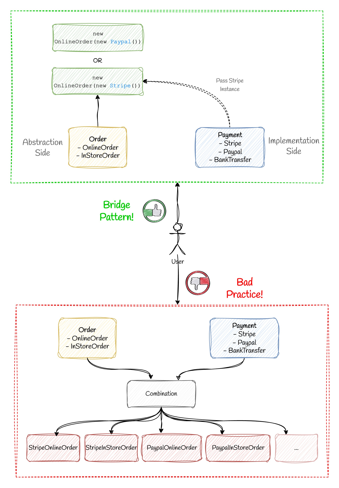

# Bridge Pattern



## 💡 Use Case

Imagine you're building an e-commerce platform that needs to process different types of orders (online orders, in-store orders, subscription orders) using various payment methods (PayPal, Stripe, bank transfers). If you directly combine these two dimensions, you'd end up with a class explosion problem (OnlineOrderWithPayPal, OnlineOrderWithStripe, InStoreOrderWithPayPal, etc.).

The Bridge pattern solves this by separating the abstraction (Order types) from the implementation (Payment methods), allowing them to vary independently.

## ❌ Bad Practice

A naive approach would be to create a separate class for each order type and payment method combination:

```ts
class OnlineOrderWithPayPal {
  processOrder(amount: number) {
    console.log("Processing online order...");
    console.log(`Paid ${amount} using PayPal`);
  }
}

class OnlineOrderWithStripe {
  processOrder(amount: number) {
    console.log("Processing online order...");
    console.log(`Paid ${amount} using Stripe`);
  }
}

class InStoreOrderWithPayPal {
  processOrder(amount: number) {
    console.log("Processing in-store order...");
    console.log(`Paid ${amount} using PayPal`);
  }
}

// And so on for each combination...
```

This approach leads to code duplication and becomes unmanageable as you add more order types or payment methods.

## ✅ Good Practice

With the Bridge pattern, we separate the order types (abstraction) from the payment methods (implementation):

First, we define the payment method interface:

```ts
export interface PaymentMethod {
  pay(amount: number): boolean;
  getPaymentDetails(): { provider: string; [key: string]: any };
}
```

Then, we implement concrete payment methods:

```ts
export class PayPalPayment implements PaymentMethod {
  private email: string;
  
  constructor(email: string) {
    this.email = email;
  }
  
  pay(amount: number): boolean {
    console.log(`Paid ${amount} using PayPal account: ${this.email}`);
    return true;
  }
  
  getPaymentDetails(): { provider: string; email: string } {
    return {
      provider: 'PayPal',
      email: this.email
    };
  }
}
```

Next, we define the abstract Order class that uses a PaymentMethod:

```ts
export abstract class Order {
  protected paymentMethod: PaymentMethod;

  constructor(paymentMethod: PaymentMethod) {
    this.paymentMethod = paymentMethod;
  }

  abstract checkout(amount: number): boolean;
  abstract getOrderType(): string;
  
  getPaymentDetails(): { provider: string; [key: string]: any } {
    return this.paymentMethod.getPaymentDetails();
  }
  
  setPaymentMethod(paymentMethod: PaymentMethod): void {
    this.paymentMethod = paymentMethod;
  }
}
```

Finally, we implement concrete order types:

```ts
export class OnlineOrder extends Order {
  private shippingAddress: string;
  
  constructor(paymentMethod: PaymentMethod, shippingAddress: string) {
    super(paymentMethod);
    this.shippingAddress = shippingAddress;
  }
  
  checkout(amount: number): boolean {
    console.log("Processing online order with shipping to: " + this.shippingAddress);
    return this.paymentMethod.pay(amount);
  }
  
  getOrderType(): string {
    return "Online Order";
  }
  
  getShippingDetails(): { address: string } {
    return { address: this.shippingAddress };
  }
}
```

Now we can use the pattern like this:

```ts
// Create payment method instances
const paypalPayment = new PayPalPayment('customer@example.com');
const stripePayment = new StripePayment('4242');

// Create order instances with different payment methods
const onlineOrder = new OnlineOrder(paypalPayment, '123 Main St, City, Country');
const inStoreOrder = new InStoreOrder(stripePayment, 'Downtown Store');

// Process different types of orders with different payment methods
onlineOrder.checkout(99.99);
inStoreOrder.checkout(49.99);

// We can even change payment method at runtime
onlineOrder.setPaymentMethod(stripePayment);
onlineOrder.checkout(99.99);
```

## 🌟 Benefits

1. **Decouples abstraction from implementation**: Orders and payment methods can evolve independently.

2. **Prevents class explosion**: Instead of creating a class for each combination, we compose objects.

3. **Runtime flexibility**: Payment methods can be switched dynamically at runtime.

4. **Open/Closed Principle**: You can add new order types or payment methods without modifying existing code.

5. **Single Responsibility Principle**: Each class has a clear responsibility (either order processing or payment handling).

## 🔍 When to Use

Use the Bridge pattern when:

- You want to avoid a permanent binding between abstractions and their implementations
- Both abstractions and implementations should be extensible independently
- Changes in the implementation shouldn't impact the client code
- You have a proliferation of classes resulting from a coupled interface and numerous implementations
- You want to share an implementation among multiple objects
