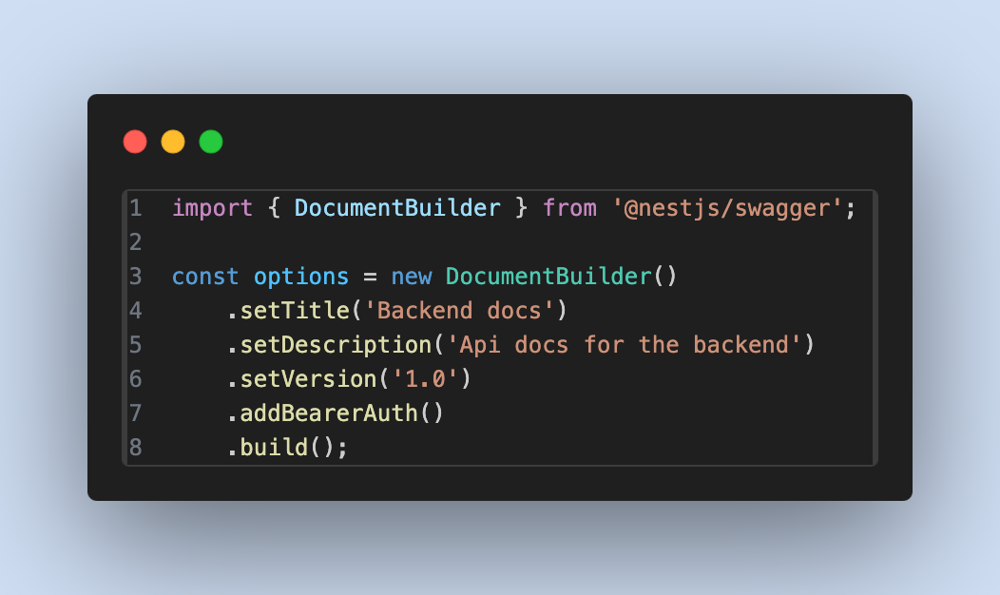

# 📚 Builder Pattern


## 💡 Use Case

Let's say you want to send some requests to an API with different resources. Some of them are `GET` requests with some param and queries, some of the are `POST` with body and some authorization headers. And you may have a combinition of them and you need to repeat them frequently.

## ❌ Bad Practice

This is not neccessarily a bad practice if you only have one request. But it can be hard to maintanance if you have multiple API calls with different shapes. Also in this approach you need to make headers (Authorization or basic header) each time for each request.

```ts
export async function makePostRequest(data: PostData) {
  const queryParams: QueryParam = {
    status: 'active',
    role: 'user',
  };

  const config: AxiosRequestConfig = {
    headers: {
      'Authorization': 'Bearer your-access-token',
      'Content-Type': 'application/json',
    },
    params: queryParams,
  };

  const response = await axios.post<ResponseData>(url, data, config);
  console.log('Response Data:', response.data);
}
```

## ✅ Good Practice

We can create the builder class, so we can build our shape of request easily. In this approach you don't need to create headers each time, you just need to indicate that you need the header.

```ts
export class RequestBuilder<T = any> implements IRequestBuilder<T> {
  private requestPayload: RequestPayload<T>;

  constructor() {
    this.requestPayload = {} as unknown as any;
  }

  setParams<T extends Record<string, any>>(param: T): this {
    this.requestPayload.params = param;
    return this;
  }

  setBasicHeaders(): this {
    const token = `username:password`;
    const encodedToken = Buffer.from(token).toString('base64');
    this.requestPayload.headers = {
      ...this.requestPayload.headers,
      Authorization: `Basic ${encodedToken}`,
    };
    return this;
  }

  setHeaders(headers: Record<string, string>): this {
    this.requestPayload.headers = {
      ...this.requestPayload.headers,
      ...headers,
    };
    return this;
  }

  setBody(body: T): this {
    this.requestPayload.data = body;
    return this;
  }

  build(): RequestPayload<T> {
    return this.requestPayload;
  }
}
```

This is how we use it and indicate that we want a specific header:

```ts
const builder = new RequestBuilder();
const request = builder
  .setParams({ name: 'John Doe' })
  .setBasicHeaders()
  .setBody({ title: 'this is title', body: 'this is body' })
  .build();
```

## Another Practical Example

If you ever worked with NestJS, you could realize that it has a similar way of building requests. But in `@nestjs/swagger`. It's called `DocumentBuilder`. Here is an example:


