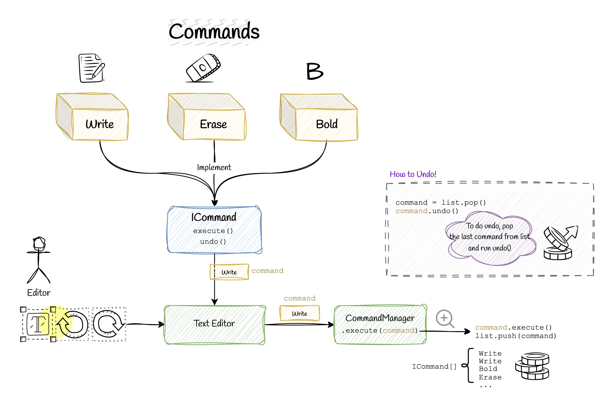

# 📚 Command Pattern


## 💡 Use Case
One of the most important use cases of command pattern is running specific commands and being able to undo (and redo) them later. Actually we keep track of the command records as a stack, then in case of undo, we run `.undo` for the most top member of the stack.

## ❌ Bad Practice

The bad practice is having a single class and handling everything there:

```typescript
export class TextEditor {
  private content: string = "";
  private undoStack: string[] = [];

  public setContent(content: string): void {
    this.content = content;
    this.undoStack.push(this.content);
  }

  public getContent(): string {
    return this.content;
  }

  public bold(start: number, length: number): void {
    // Save the current content to the undo stack before making changes
    // Apply bold (Markdown style) to the selected text
  }

  public italic() { /* ... */ }

  // Undo the last operation (revert to the previous state)
  public undo(): void {}
}
```

For more information you can see the full source code.


## ✅ Good Practice

We separate each command (write, bold, italic, etc) to it's own class. Each command has `execute` and `undo` method. Now we keep each instance in our stack by the help of `CommandManager` class and run `undo` on each member whenever needed.

```typescript
export class CommandManager implements ICommandManager {

  private executedCommands: ICommand[] = [];
  private undoneCommands: ICommand[] = [];

  execute(command: ICommand): void {
    command.execute();
    this.executedCommands.push(command);
    this.undoneCommands = []; // Clear the redo stack since we executed a new command
  }

  undo(): void {
    const command = this.executedCommands.pop();
    if (command) {
      command.undo();
      this.undoneCommands.push(command);
    }
  }

  redo(): void {
    const command = this.undoneCommands.pop();
    if (command) {
      command.execute();
      this.executedCommands.push(command);
    }
  }
}
```

Again, for more information you can see the full source code.
