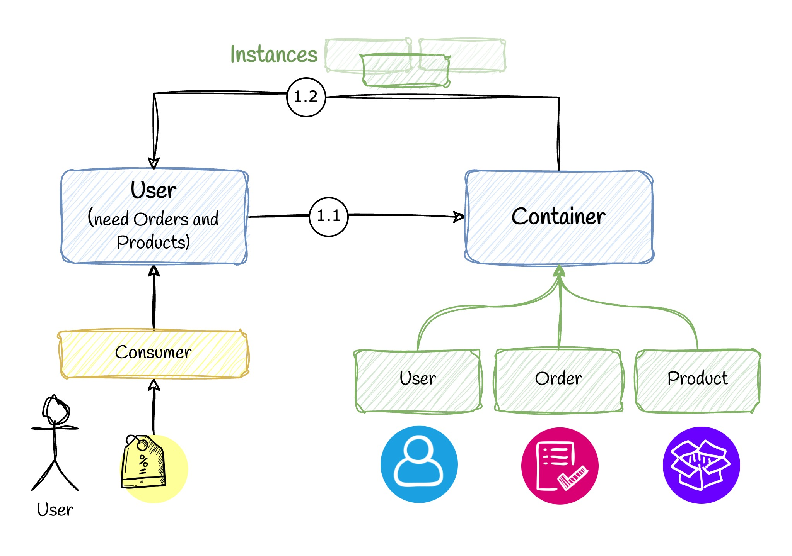

# 📚 Dependency Injection Pattern


## 💡 Use Case

Let's say you want to use some other classes in your User class (e.g. order)

## ❌ Bad Practice

This method violates Inversion of Control. For more info [check this article.](https://medium.com/p/7092c8a0ae7a)


```ts
class Order {
  constructor() {}

  getOrderByUser(userId) {
    console.log('return order of user:', userId);
  }
}

class User {
  private order: Order;
  constructor() {
    this.order = new Order();
  }

  getUser(userId) {
    this.order.getOrderByUser(userId);
    console.log('return user and order of user with id:', userId);
  }
}

let user = new User();
let userId = 5;
user.getUser(userId);
```

## ✅ Good Practice

Now we can implement dependency injection (an implementation of IoC). Again, [see here for more info](https://medium.com/p/7092c8a0ae7a).

```ts
import { Container, Injectable } from "./container";

@Injectable()
class ProductService {
  constructor() {}

  getProducts() {
    console.log('getting products..!! 🍊🍊🍊');
  }
}

@Injectable()
class OrderService {
  constructor(private productService: ProductService) {}

  getOrders() {
    console.log('getting orders..!! 📦📦📦');
    this.productService.getProducts();
  }
}


@Injectable()
class UserService {
  constructor(private orderService: OrderService) {}

  getUsers() {
    console.log('getUsers runs!');
    this.orderService.getOrders();
  }
}

const app = new Container().init([UserService]);
const userService = app.get(UserService);

userService.getUsers();
```

Note 1: Check `container.ts` for imported files.

Note 2: For large scale projects, I recommend using some frameworks like [NestJS](https://nestjs.com/) or some community packages like [Inversify](https://github.com/inversify/InversifyJS) to have DI. Because this was just a basic implementation just as a proof of concept so you don't want to re-invent the wheel.
