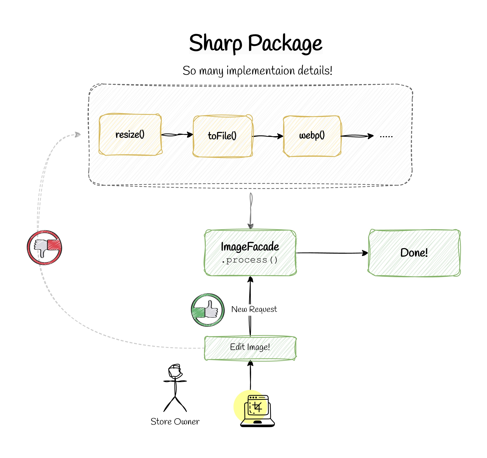

# 📚 Facade Pattern



## 💡 Use Case

When to Use Facade Pattern

- You want to simplify a complex subsystem by providing a unified interface
- You need to decouple client code from subsystem components
- You want to layer your subsystems and provide entry points to each layer

In this example, we use the Facade pattern to simplify image processing operations using the Sharp library.

## 🎯 Scenario

You want to:

- Resize an image
- Add watermark
- Convert to WebP
- Optimize quality
- Save in multiple sizes (thumbnail, medium, large)

Using sharp directly can get messy very fast.

## ✅ Good Practice

Create a Facade that hides all Sharp complexity behind a clean API.

```ts
import sharp from "sharp";
import path from "path";

interface ProcessOptions {
  generateThumbnail?: boolean;
  watermark?: boolean;
}

export class ImageProcessingFacade {
  constructor(private readonly watermarkPath: string) {}

  async process(inputPath: string, outputDir: string, options: ProcessOptions = {}) {
    const baseName = path.basename(inputPath, path.extname(inputPath));

    if (options.generateThumbnail) {
      await this.createThumbnail(inputPath, outputDir, baseName);
    }

    await this.createMedium(inputPath, outputDir, baseName);

    if (options.watermark) {
      await this.createLargeWithWatermark(inputPath, outputDir, baseName);
    } else {
      await this.createLarge(inputPath, outputDir, baseName);
    }
  }

  // Private methods handle the complex operations
  private async createThumbnail(input: string, outputDir: string, name: string) {
    await sharp(input)
      .resize(200, 200)
      .webp({ quality: 80 })
      .toFile(path.join(outputDir, `${name}-thumb.webp`));
  }

  // ... other methods
}
```

### 🧼 Clean Usage (Client Code)

```ts
const imageProcessor = new ImageProcessingFacade("watermark.png");

await imageProcessor.process("photo.jpg", "./uploads", {
  generateThumbnail: true,
  watermark: true,
});
```

## ❌ Bad Practice

Without Facade (Using Sharp Directly Everywhere):

```ts
import sharp from "sharp";
import fs from "fs";

async function processImage(inputPath: string) {
  const image = sharp(inputPath);

  // Thumbnail
  await image
    .resize(200, 200)
    .composite([{ input: "watermark.png", gravity: "southeast" }])
    .webp({ quality: 80 })
    .toFile("output-thumb.webp");

  // Medium
  await sharp(inputPath).resize(800).webp({ quality: 85 }).toFile("output-medium.webp");

  // Large
  await sharp(inputPath).resize(1600).jpeg({ quality: 90 }).toFile("output-large.jpg");
}
```

### 🔥 Why This Is Bad

1. Every developer must understand Sharp's complex API
2. Logic is duplicated everywhere
3. Business logic mixed with technical configuration
4. Hard to change watermark or formats globally
5. Hard to test
6. Changes to the library or requirements require modifying code in multiple places
