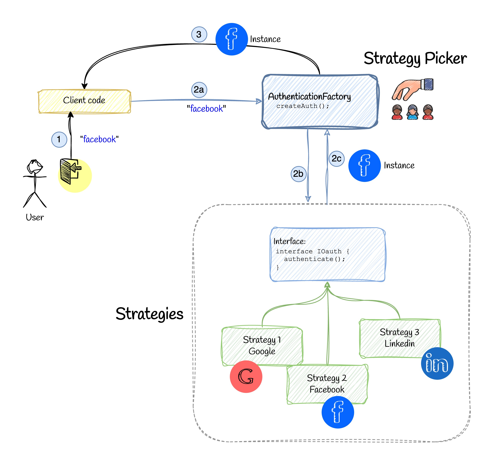

# 📚 Factory Method Pattern


## 💡 Use Case 1 - Static Factory

Previously we learned about the Strategy Pattern. Now we want to decide which strategy to use at runtime. Instead of repeating this decision in every place, we can use the Factory Method Pattern to avoid this repetition.

## ❌ Bad Practice

```ts
const userInput = 'Google'; // user can send anything
let auth;
switch (userInput) {
  case 'Google':
    auth = new GoogleAuth();
  case 'Facebook':
    auth = new FacebookAuth();
  case 'LinkedIn':
    auth = new LinkedInAuth();
  default:
    throw new Error('Unsupported authentication type');
}
auth.authenticate();
```

## ✅ Good Practice

Now we can use the Factory Method Pattern to avoid this repetition. We can create a factory class that creates the authentication object based on the user input. This way, we can avoid repeating the decision in every place.

```ts
export type AuthType = 'Google' | 'Facebook' | 'LinkedIn';

export class AuthenticationFactory {
  static createAuthentication(type: AuthType): IOAuth {
    switch (type) {
      case 'Google':
        return new GoogleAuth();
      case 'Facebook':
        return new FacebookAuth();
      case 'LinkedIn':
        return new LinkedInAuth();
      default:
        throw new Error('Unsupported authentication type');
    }
  }
}

const typeUserInput: AuthType = 'Google'; // Change this to 'Facebook' or 'LinkedIn' to test other providers
const authProvider = AuthenticationFactory.createAuthentication(typeUserInput);
authProvider.authenticate();
```

## 💡 Use Case 2 - Factory Method

Factory method is a bit more than a simple static factory. Now, it's time to introduce concrete factory classes. We can create a factory class for each authentication provider. The following implementation is known as "Factory Method".

First we need a "Superclass":

```ts
abstract class OAuthFactory {
  abstract createAuthentication(): IOAuth;

  authenticate() {
    const auth = this.createAuthentication();
    auth.authenticate();
  }
}
```
Now each concrete factory class extends the `OAuthFactory` class and implements the `createAuthentication` method. The `createAuthentication` method returns the relevant authentication object.

```ts
class GoogleAuthFactory extends OAuthFactory {
  createAuthentication(): IOAuth {
    return new GoogleAuth();
  }
}

class FacebookAuthFactory extends OAuthFactory {
  createAuthentication(): IOAuth {
    return new FacebookAuth();
  }
}

class LinkedInAuthFactory extends OAuthFactory {
  createAuthentication(): IOAuth {
    return new LinkedInAuth();
  }
}
```

**Note:** Since they already extend `OAuthFactory`, we don't need to define `authenticate` method in the concrete factory classes. So the following code:

```ts
class GoogleAuthFactory extends OAuthFactory {
  createAuthentication(): IOAuth {
    return new GoogleAuth();
  }
}
```

Is the same as:
```ts
class GoogleAuthFactory {
  createAuthentication(): IOAuth {
    return new GoogleAuth();
  }

  // Without supperclass, we would've needed this:
  authenticate() {
    const auth = this.createAuthentication();
    auth.authenticate();
  }
}
```

But since `authenticate` method is the same for all, we use inheritance to avoid duplicating the code. We see that "Template" Pattern is also used in the Factory Method Pattern.

Then we can use the factory class to create the authentication object:

```ts
const authProvider = new GoogleAuthFactory();
authProvider.authenticate();
```

### Comparison

🤔 When to Use Static vs Concrete Factory

| Use Case                          | Static Method     | Concrete Factory Class |
| --------------------------------- | ----------------- | ---------------------- |
| Simple scenarios                  | ✅ Preferred      | 🚫 Overkill            |
| Number of files/classes           | ✅ A few          | 🚫 So many             |
| Testing or mocking needed         | 🚫 Harder to mock | ✅ Easier to mock      |
| Multiple steps/config in creation | 🚫 Hard to manage | ✅ More structured     |
| Open/Closed principle             | 🚫 Violating      | ✅ Not Violating       |


### Conclusion

For simple scenarios, using a static method is a good choice. Carefully choice between static method and concrete factory class based on your project's requirements.
