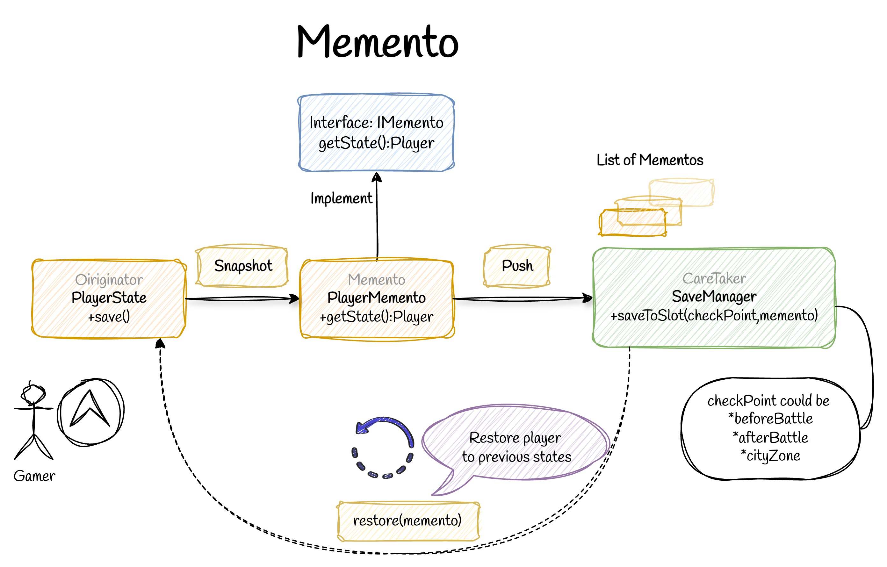

# 🕹️ Memento Pattern 
  

## 💡 Use Case  
Suppose you want to create a game where the player’s state (health, level, status) can be saved and restored at any point to allow rollback or undo functionality.

## ❌ Bad Practice

```ts
export class BadPlayer {
  public health: number = 100;
  public level: number = 0;
  public isDead: boolean = false;
  public name: string = 'Hero';
}

function getPlayerInfo(player: BadPlayer): string {
  const status = player.isDead ? 'Dead' : 'Alive';
  return `Player: ${player.name} | Status: ${status} | Level: ${player.level} | Health: ${player.health}`;
}

// Save state manually
console.log('Playing and manually saving...');
player.level += 1;
const savedState = {
  health: player.health,
  level: player.level,
  isDead: player.isDead,
  name: player.name
};

player.health = savedState.health;
player.level = savedState.level;
player.isDead = savedState.isDead;

```
## Why Bad
-Manual copying is error-prone(check out `savedState()`)
-All fields are public which destroys encapsulation
-Easy to mess up with properties

## ✅ Good Practice

```ts

const player = new PlayerState(100, 1, false, 'Hero');
const saveManager = new SaveManager();

console.log('Starting game');
console.log(player.getInfo());

player.levelUp();
saveManager.saveToSlot('beforeBattle',player.save());
console.log(player.getInfo());

console.log('Continue playing and leveling up');
player.levelUp();
saveManager.saveToSlot('cityZone', player.save());
console.log(player.getInfo());

// Player died
player.die();
console.log(player.getInfo());

// Restoring from save: beforeBattle
player.restore(saveManager.loadFromSlot('beforeBattle'));
console.log(player.getInfo());

```
## Why Good

- Keeps player state encapsulated, avoiding direct access to private data.
- Allows multiple checkpoints with  `saveToSlot()`
- Easy to restore previous states with `restore()`


## 🆚 Memento vs. Strategy Patterns  

| Feature           | Memento Pattern                                     | Strategy Pattern                                      |
| ----------------- | -------------------------------------------------- | ---------------------------------------------------- |
| Purpose           | Get and Restore object state snapshots         | Define a family of algorithms interchangeable at runtime |
| Focus             | State preservation, undo/restore                   | Behavior encapsulation, selecting algorithms dynamically |
| Key Benefit       | Undo capability without exposing private data         | Flexible behavior without class explosion              |
| Common Use Cases  | Undo Player state, Text Editor    | Sorting Algorithms, payment methods, Authentication methods |

---

**Main Questions** 
- "Do I need to **save and restore** an object's state?" → **Use Memento**
- "Do I need to **switch between different behaviors**?" → **Use Strategy**

