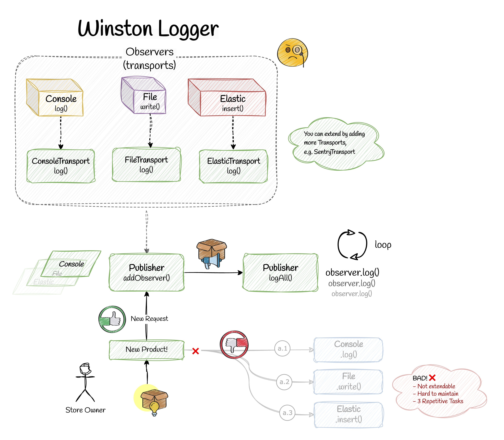

## 💡 Use Case

Let's say we have an online shop. When admin want to introduce a new product, we need to notify multiple services or objects. Like database, cache and customers. Let's see how we can do this in practice:

## ❌ Bad Practice

One way is to have seperate classes and call them one by one:

```ts
const product = {
  id: 1,
  title: 'New Product',
  body: 'This is a new product for 2025.',
};

const db = new Db();
const cache = new Cache();
const customers = new Customers();

db.update(product);
cache.save(product);
customers.sendPush(product);
```

## ✅ Good Practice

Now we can implement Observer Pattern. Basically, each observer class (e.g. Cache) implements the same interface called `Observer`:

```ts
export interface Observer {
  notify(payload: any): boolean
}
```

So each class has a method called `notify`. We also have a `Subject` interface (also known as `Observable`):

```ts
export interface Subject {
  attach(observer: Observer): void;
  detach(observer: Observer): void;
  notify(payload): void;
}
```

The responsibility of `Subject` interface is to have a list of `Observer`s. We can push to this list with `attach` method. We can also remove an specific Observer from this list with `detach` method. Eventually we have `notify` method that notifies all the observers in a loop. Let's see the implementation:

```typescript
export class NewProductPublisher implements Subject {
  public observers: Observer[] = [];

  attach(observer: Observer): void {
    const isExist = this.observers.includes(observer);
    if (!isExist) {
      this.observers.push(observer);
    }
  }

  detach(observer: Observer): void {
    const observerIndex = this.observers.indexOf(observer);
    this.observers.splice(observerIndex, 1);
  }

  notify(payload): void {
    for (const observer of this.observers) {
      observer.notify(payload);
    }
  }
}
```

