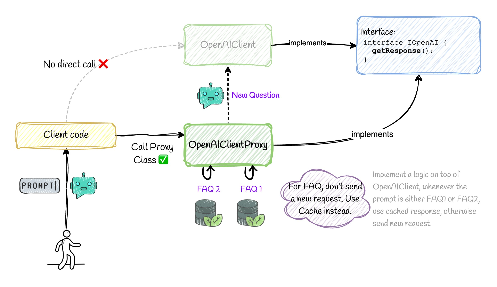

# 📚 Proxy Pattern


## 💡 Use Case

Before going through the design pattern, let's review another similar design pattern called the **[Decorator Pattern](https://github.com/vahidvdn/realworld-design-patterns/tree/master/app/decorator)**:

We already saw that we have the following concept in **Design Patterns**:

```ts
// Instead of this 
Db.save();
Event.publish();

// We have a wrapper class called StorableEvent
StorableEvent.publish(); // first stores then publishes
```

Proxy pattern is very similar to Decorator Pattern from **Structure** point of view. It has a different purpose though. In Decorator Pattern, we can add additional functionality to the original object e.g. we added saving ability to the original object (Event class) by introducing StorableEvent class. In Proxy Pattern, we want to **Limit** the access to the original object. Let's see the advantages of Proxy Pattern:

- Decouple **limitation** logic from the original object
- **Control** the access to the original object
- **Cache** the original object
- Apply any control for 3rd party classes

As we see in the diagram above, we want to send a request to OpenAI APIs. We don't want to call it each time the question is related to some well-known FAQs. Instead we want to return a cached response if it's available. This is a perfect use case for Proxy Pattern.

## ❌ Bad Practice

Here, bad practice is to couple the limitation logic with the original object. In this case, we are coupling the `OpenAI` class with the `Cache` class.

## ✅ Good Practice

First let's implement our original object:

```ts
export class OpenAIClient implements IOpenAI {
  async getResponse(prompt: string): Promise<string> {
    // Simulate OpenAI API call
    console.log('Calling OpenAI...');
    return `Response for: ${prompt}`;
  }
}
```

Now we are going to implement the `Proxy` class, which will be responsible for the caching logic based on our original object.:

```ts
export class OpenAIClientProxy implements IOpenAI {
  private cache = new Map<string, string>();

  constructor(private realClient: OpenAIClient) {}

  async getResponse(prompt: string): Promise<string> {
    if (this.shouldCache(prompt)) {
      if (this.cache.has(prompt)) {
        console.log('Returning cached result...');
        return this.cache.get(prompt)!;
      }
    }

    const response = await this.realClient.getResponse(prompt);

    if (this.shouldCache(prompt)) {
      this.cache.set(prompt, response);
    }

    return response;
  }

  private shouldCache(prompt: string): boolean {
    // Simple keyword-based condition. Customize as needed.
    const keywordsToCache = ['FAQ1', 'FAQ2', 'FAQ3'];
    return keywordsToCache.some(keyword => prompt.includes(keyword));
  }
}
```

🔗 Related Patterns:

- [Decorator Pattern](../decorator/README.md): Explained above
