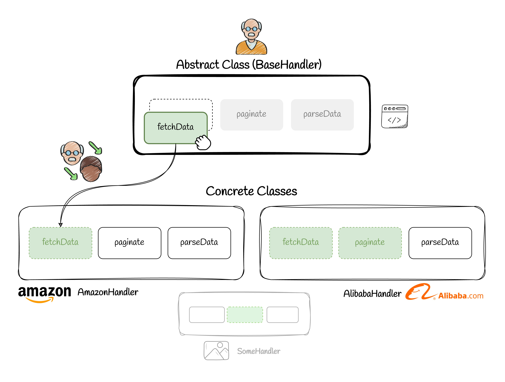

# 📚 Template Method Pattern


## 💡 Use Case

Let's say we have some similar tasks that has some identical steps and some different steps. For example, we want to fetch the list of products from different providers (e.g. Amazon, Alibaba, etc). Some steps are the same, like sending request, some steps are optional, like pagination and some steps are different for each one. Let's see how it works.

## ❌ Bad Practice

One way is to have seperate functions for each one, which is not the best approach. The more you add different providers, the more it becomes unmaintainable.

```ts
export const getProducts = async (data) => {
  const amazonProducts = await makePostRequest(data);
  const paginatedAmazonProducts = await paginateAmazonData(amazonProducts);
  const parsedAmazon = await parseAmazonData(paginatedAmazonProducts);

  const alibabaProducts = await makePostRequest(data);
  const paginatedAlibabaProducts = await paginateAlibabaData(alibabaProducts);
  const parsedAlibaba = await parseAlibabaData(paginatedAlibabaProducts);

  return [parsedAmazon, parsedAlibaba];
}
```

## ✅ Good Practice

Now we can implement template method. Basically, template method is a parent class that you define some of the identical steps and also indicate abstract methods when they are different for each child class. So each child has it's own implementation for that specific method.

Also you have a method in parent class that runs all the steps one by one, which is usually the same for all the children.

```ts
import { IBaseHandler, Paginated } from "./interface";
import axios, { AxiosRequestConfig } from "axios";

export abstract class BaseHandler<T, K> implements IBaseHandler<T, K> {
  protected baseUrl = 'https://jsonplaceholder.typicode.com';
  protected api = 'posts';

  abstract parseData(data: T | Paginated<T>): number[];

  async fetchData(data: K): Promise<T> {
    const url = `${this.baseUrl}/${this.api}`
    const config: AxiosRequestConfig = {
      headers: {
        'Authorization': 'Bearer your-access-token',
        'Content-Type': 'application/json',
      },
    };
    const response = await axios.post<T>(url, data, config);
    return response.data;
  }

  async paginate(data: T): Promise<T | Paginated<T>> {
    return data;
  }

  async handle(data: K) {
    const result = await this.fetchData(data);
    const paginated = await this.paginate(result);
    const parsed = this.parseData(paginated);
    return parsed;
  }

}

```

As you see in the above code we also used typescript generic types. Then each child pass it's own shape of data. Check the full version of code to get more detailed info.
